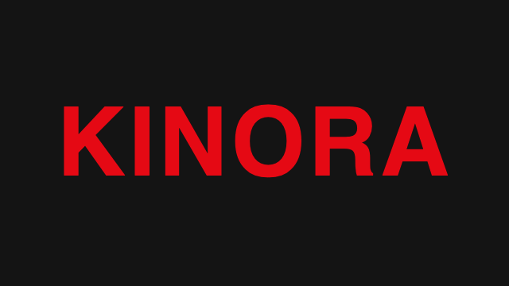

<div align="center">



### Every movie. Every show. Your server.

Your own streaming service, on your own server. Browse a catalog of every movie and show, press play, and kinora searches every source
it knows to start the best stream it finds. In your browser, on your phone and on your Android TV.

[](https://github.com/ermos/kinora/actions/workflows/ci.yml)
[](LICENSE)

[Website](https://kinora.stream) · [Documentation](https://kinora.stream/docs/intro) · [Installation](https://kinora.stream/docs/installation)

</div>

## Why kinora

Most self-hosted media servers expect you to already have the files. kinora doesn't: it pairs the
[TMDB](https://www.themoviedb.org) catalog with a Go port of the community Kodi addons
([vStream](https://github.com/Kodi-vStream/venom-xbmc-addons) and [Scrubs V2](https://github.com/jewbmx/repo)), so any
movie, show or anime is one click away. No Kodi, no torrent client, no disk full of files. Just a Netflix-style app
that your whole family already knows how to use.

## Features

- **The interface you already know**: rows, a big hero, profiles, "Continue watching", a list per profile, watch
  history, likes.
- **Every source in parallel**: press play, kinora queries every active source, measures the real resolution of each
  stream (4K, 1080p, 720p...) and starts the best one. Dead links fall back on their own.
- **Built for the couch**: web, phone and a native Android TV app that updates itself. Everything works with a remote,
  a keyboard or a mouse. TVs sign in with a short code, no typing.
- **Skip intro and credits** on anime, from the community timestamps of [AniSkip](https://aniskip.com).
- **Accounts and profiles**: you create the accounts, up to 5 profiles each. No public sign-up.
- **A private proxy**: streams go through your server with HMAC-signed links that expire after 12 hours. Not an open
  proxy.
- **Low maintenance**: site domains sync automatically every 6 hours. Sites behind Cloudflare work through an optional
  [FlareSolverr](https://github.com/FlareSolverr/FlareSolverr).
- **Light**: a single Go binary with the web app built in, next to PostgreSQL.
- **French and English** sources and interface, picked per instance.

## Quick start

You need Docker and a free [TMDB API key](https://www.themoviedb.org/settings/api). The image,
`ghcr.io/ermos/kinora`, is published for `amd64` and `arm64`.

```sh
mkdir kinora && cd kinora
curl -fsSLO https://kinora.stream/docker-compose.yml
echo "TMDB_API_KEY=your_tmdb_key" > .env
docker compose up -d
```

Open [http://localhost:8080](http://localhost:8080) and create the admin account.

| Client | Where to get it |
|---|---|
| Web (computer, phone, tablet) | built into the server |
| Android TV and Google TV | `app-release.apk` in the [latest release](https://github.com/ermos/kinora/releases/latest) |

Updates, backups, reverse proxy, building from source: see the
[installation guide](https://kinora.stream/docs/installation).

## Android TV

Download the APK from the [latest release](https://github.com/ermos/kinora/releases/latest), install it on your TV
(adb, a USB stick or the Downloader app) and enter your server address. New versions are offered from inside the app.
See the [Android TV guide](https://kinora.stream/docs/android-tv) to build it yourself.

## Documentation

Everything lives on [kinora.stream](https://kinora.stream):

- [Installation](https://kinora.stream/docs/installation)
- [Configuration](https://kinora.stream/docs/configuration)
- [Android TV](https://kinora.stream/docs/android-tv)
- [Sources and quality](https://kinora.stream/docs/sources)
- [Development](https://kinora.stream/docs/development): architecture, adding a language, porting a source

## Tech stack

Go (single binary, `//go:embed` web app), PostgreSQL, Expo / React Native (web and Android TV, tvOS later), an OpenAPI
3.1 contract generated from the Go handlers and consumed as a typed TypeScript client.

## Contributing

Issues and pull requests are welcome. Sites change all the time, so the most useful contributions are fixes for
broken sources and hosters: `make test-live` checks every one of them against the real sites. The
[development guide](https://kinora.stream/docs/development) explains how to run kinora locally and how to port a
source. The `docker-compose.yml` of this repository builds the image from the sources
(`cp .env.example .env && docker compose up -d --build`).

Commits follow [Conventional Commits](https://www.conventionalcommits.org).

## Disclaimer

kinora does not host, store or distribute any content. It finds links on third-party websites, the same way the Kodi
addons it ports do. You are responsible for what you stream: check what your local law allows.

kinora is not affiliated with Netflix. This product uses the TMDB API but is not endorsed or certified by TMDB.

## Acknowledgements

[vStream](https://github.com/Kodi-vStream/venom-xbmc-addons), [Scrubs V2](https://github.com/jewbmx/repo),
[TMDB](https://www.themoviedb.org), [AniSkip](https://aniskip.com),
[Fribb/anime-lists](https://github.com/Fribb/anime-lists) and
[FlareSolverr](https://github.com/FlareSolverr/FlareSolverr).

## License

[GNU Affero General Public License v3.0](LICENSE). If you run a modified version of kinora as a service, you must share
its source with its users.
